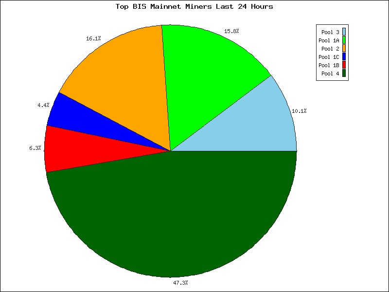
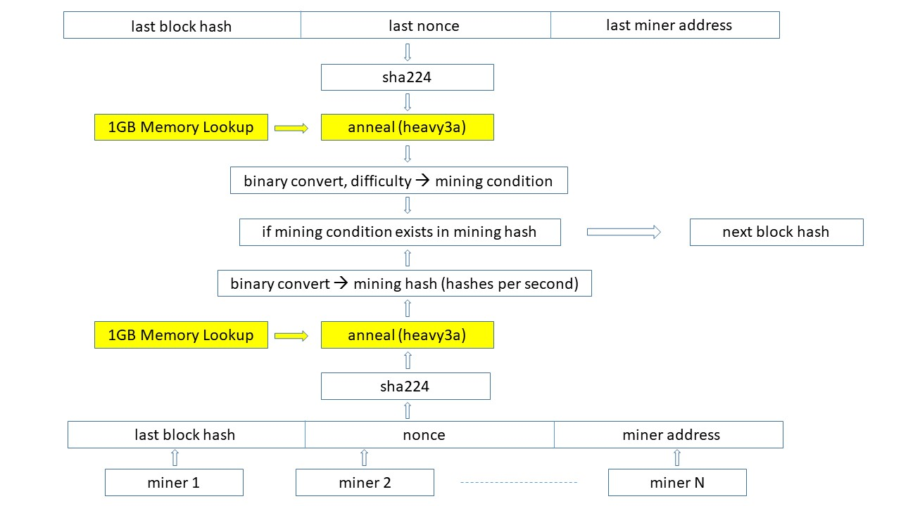
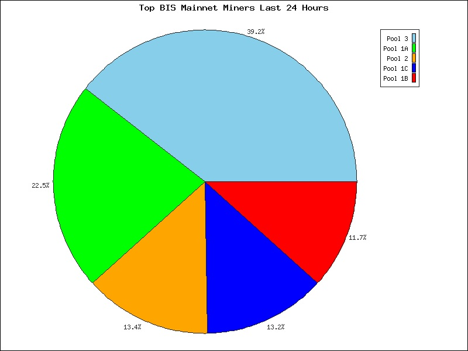
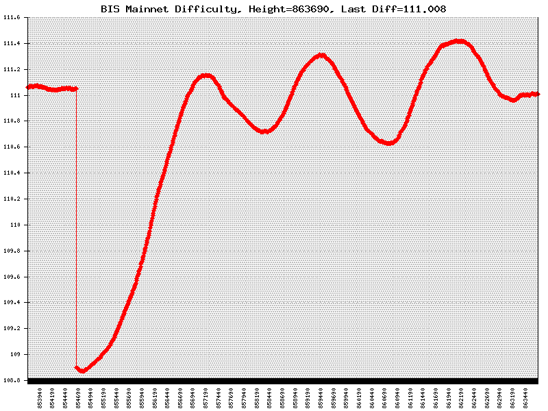
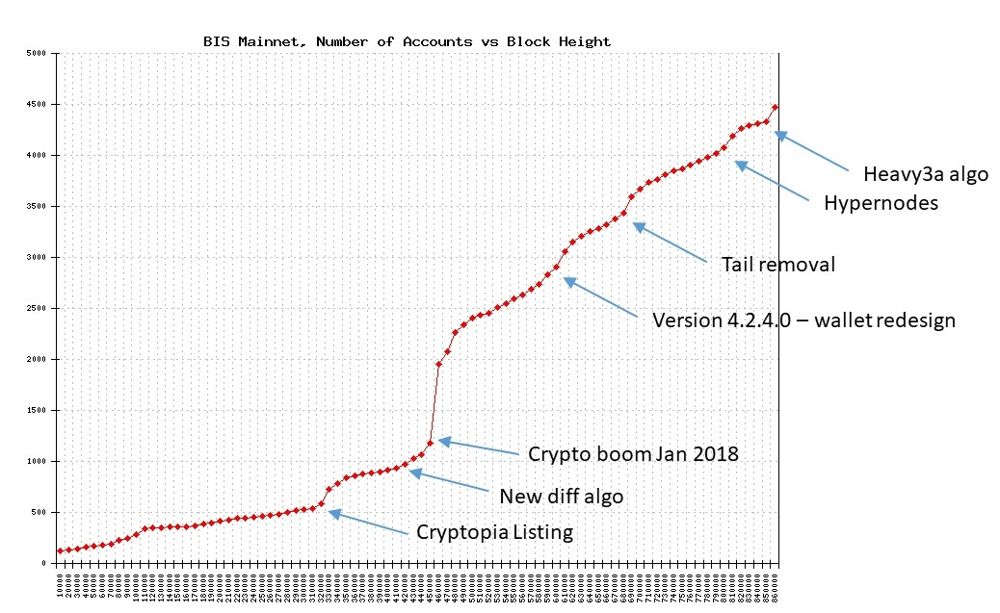

# Bismuth Mining Evolution

The mainnet of the Bismuth cryptocurrency project was launched on May 1st, 2017. The mining algorithm was based on sha224 and is described here: <a href='http://dx.doi.org/10.4173/mic.2017.4.1'>http://dx.doi.org/10.4173/mic.2017.4.1</a>. In the beginning there were only CPU miners, but after less than 6 months the first GPU miners appeared and shortly afterwards the first GPU mining pools. Bismuth was listed on the Cryptopia exchange during October 2017, and that led to a large increase in new accounts on the network. By January 2018 the number of Bismuth accounts had quadrupled compared to before the exchange listing.

Since Bismuth had a relatively simple mining algorithm requiring very little memory on the GPUs, the network was vulnerable to a 51% attack by a large FPGA or ASIC mining operation. The core development team was well aware of this threat, but decided to work on other issues instead, such as general network stability improvements, in addition to new functions and features. The introduction of hypernodes and the side-chain is one example.

During August and September 2018 it became increasingly evident that an FPGA miner had been developed, and that this mining operation was approaching a 51% portion of the overall mining power in the network. The figure below shows the hashrate distribution of the different pools at that time:  
  

The FPGA operation was alternating between mining on his own account and using Pool 4 in the figure above. It is believed that a very large portion of the hashrate by Pool 4 shown in the chart above was contributed by the FPGA miner operation. After the hypernodes had been successfully launched, the core dev team had to act swiftly, and an evolution of the mining algorithm moved to the top of the priority list, even though this had not been placed on the roadmap which was published a few months earlier. The modified mining algorithm was developed and tested on a private testnet in record time during September 2018. It took less than 3 weeks from the first conceptual ideas until launch of the new mining algorithm. Even with this rapid pace of development, the exchanges and the pools were given 1 week's notice and time to update their nodes.

On October 8, 2018 (block height 854,660) the new and novel mining algorithm was introduced on the Bismuth mainnet. Previously the Bismuth mining algorithm was computationally expensive, but required little memory. In order to make the new mining algorithm more resistant to FPGAs and ASICs, a requirement to hold a 1GB random binary file in memory was introduced, as illustrated with the yellow boxes in the chart below:  

  

A few days after the new mining algorithm was introduced the distribution of the hashrate among the pools was as shown below:  
  

After the hardfork, the hashrate from the FPGAs disappeared from the network. The three remaining operating pools were all GPU pools only.

The difficulty plot before and after the hardfork is shown in the plot below:   
  

Since it was expected that about 50% of the hashrate would disappear after the hardfork, because of the new, memory intensive algorithm, a difficulty drop down to 108.9 was hard-coded into the node. As seen from the plot above, it took about 6 days (9000 blocks) before the difficulty level stabilized at 111.0. This level is more or less the same as before the hardfork. It is believed that the 40-50% hashrate which was previously provided by the FPGAs, was compensated by GPU miners (both new and previous miners which had left) returning to Bismuth. The hardfork had a positive effect on the number of accounts, which can be seen in the plot below:  

  
